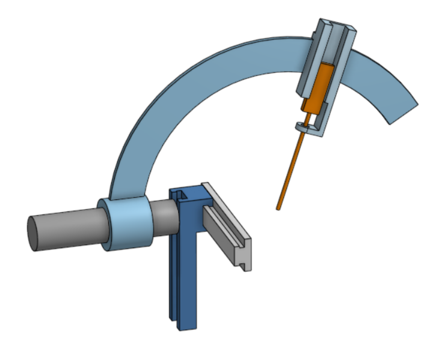
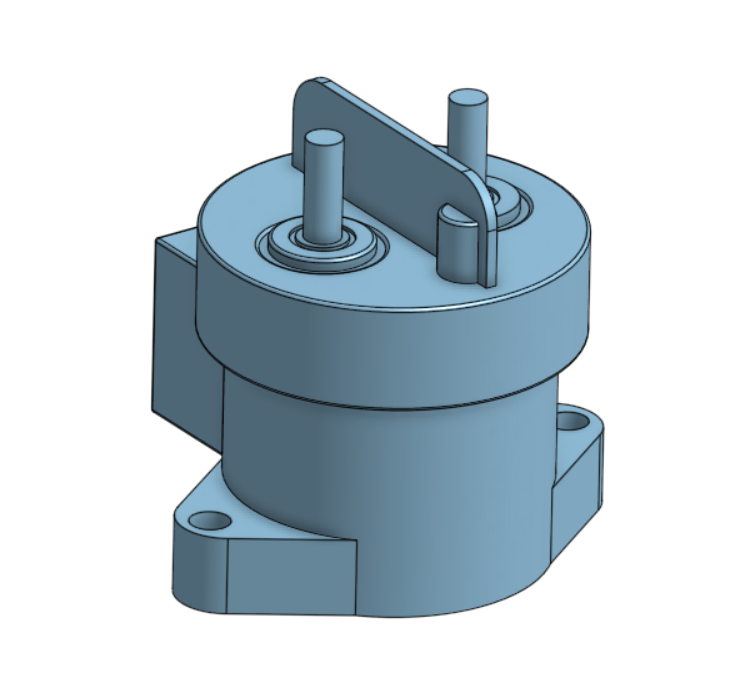

# Engineering CAD Showcase 
A collection of mechanical and engineering CAD models designed using Onshape.

---

## Craniotomy Surgery Simulation Device [(View Onshape CAD Model)](https://cad.onshape.com/documents/f4111ffab0eccb1e3d445785/w/4bb6e7194043165b2c49d504/e/afd5fefd0b043a1373d3d421)

### CAD Preview

### Overview

A simplified stereotactic craniotomy positioning simulator inspired by neurosurgical positioning systems.

This model was designed to simulate multi-axis positioning mechanisms, including X-Y-Z translational movement and spherical angular adjustment for surgical trajectory positioning. 

The project focuses on articulated mechanical structures, constrained motion systems, and precision-oriented positioning concepts commonly found in stereotactic surgical devices.

This model was recreated based on a stereotactic craniotomy positioning device used in biopsy-related surgical applications as part of laboratory research related to puncture-assisted surgical robotics. The project focused on understanding the relative motion and positioning mechanisms involved in needle-guidance systems, including translational adjustment and angular positioning used for surgical targeting.

---

## 士林-SHDC-Relay [(View Onshape CAD Model)](https://cad.onshape.com/documents/e8ce254df6ffb0875b224aa8/w/989af8982618a9c3ca728cf3/e/b6e5b46d031a03822d19b754)

### CAD Preview

