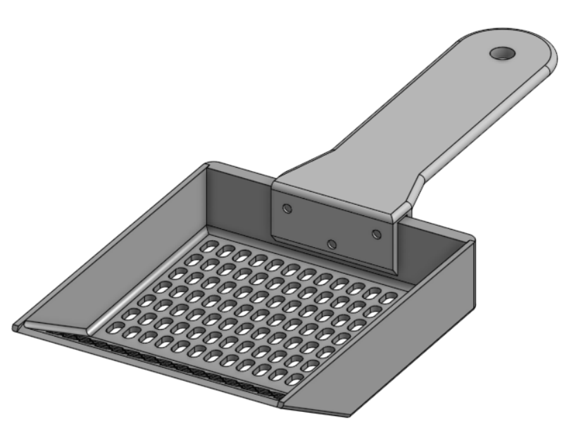

# Engineering CAD Showcase 
A collection of mechanical and engineering CAD models designed using Onshape.

---

## Craniotomy Surgery Simulation Device [(View Onshape CAD Model)](https://cad.onshape.com/documents/f4111ffab0eccb1e3d445785/w/4bb6e7194043165b2c49d504/e/afd5fefd0b043a1373d3d421)

### CAD Preview

### Overview

A simplified stereotactic craniotomy positioning simulator inspired by neurosurgical positioning systems.

This model was designed to simulate multi-axis positioning mechanisms, including X-Y-Z translational movement and spherical angular adjustment for surgical trajectory positioning. 

This model was recreated based on a stereotactic craniotomy positioning device used in biopsy-related surgical applications as part of RMML lab research related to puncture-assisted surgical robotics. 

I created this model to help me better understand the relative motion and positioning mechanisms used in needle-guidance systems, including translational movement and angular positioning for surgical targeting. 

---

## 士林-SHDC-Relay [(View Onshape CAD Model)](https://cad.onshape.com/documents/e8ce254df6ffb0875b224aa8/w/989af8982618a9c3ca728cf3/e/b6e5b46d031a03822d19b754)

### CAD Preview

### Overview

This CAD model of the SHDC relay recreated through direct measurement and dimensional reconstruction for assembly simulation purposes.

This model was created as part of laboratory work related to the development of a tomato-harvesting machine of RMML lab, where multiple mechanical and electrical components were modeled for system-level assembly simulation. 

The relay geometry was reconstructed by measuring the physical component using calipers and reproducing its structure in Onshape for integration into the larger machine assembly.

---

## Litter Scoop [(View Onshape CAD Model)](https://cad.onshape.com/documents/01643622b29970e73ae334e6/w/59c8b490f94476a22a49d5ff/e/7dd1bf9a9804e93ee98f46f0)

### CAD Preview

### Overview

A custom-designed litter scoop created for cleaning my pet mouse enclosure.( ´•ᴗ•ก)՞ ՞ 

Since the commercial cat litter scoops available on the market had openings that were too large for filtering small mouse waste, I decided to design my own scoop with a more suitable hole pattern and filtering structure. 

After testing the design with a 3D-printed prototype, it turned out to work surprisingly well, and I now use it every day.
